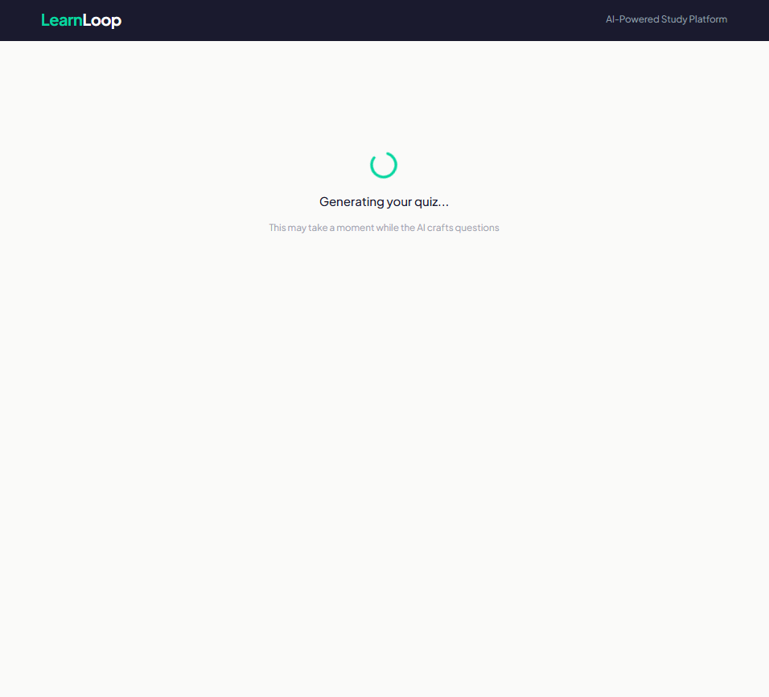
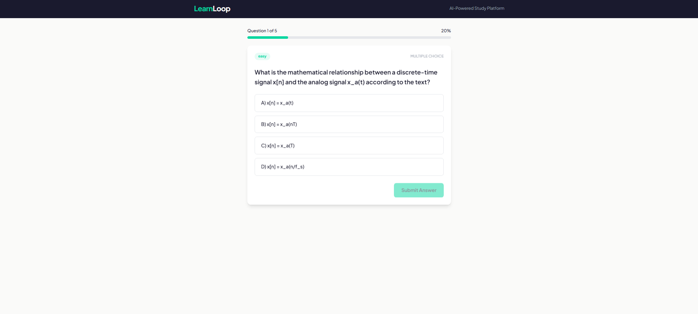
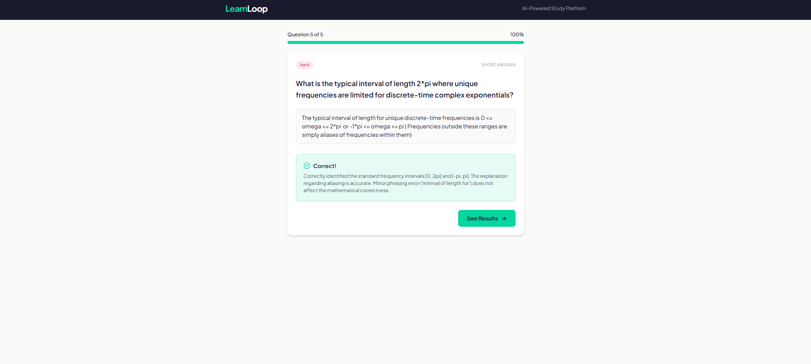

<p align="center">
  
</p>

<h1 align="center">LearnLoop</h1>

<p align="center">
  <strong>AI-Powered Adaptive Study Platform</strong><br>
  Generate quizzes from any document or topic using a local LLM. Get instant feedback, score breakdowns, and Socratic coaching.
</p>

<p align="center">
  
  
  
  
  
  
</p>

---

## Screenshots

| Home & Generation | Quiz Taking | Feedback & Grading |
|:-:|:-:|:-:|
|  |  |  |

---

## What's Working Today

- **Document upload** (PDF, TXT) with text extraction and chunking
- **Quiz generation** from uploaded documents or free-text topics (2-50 questions, MCQ + short answer + true/false mix)
- **Answer submission** with instant LLM-graded feedback and explanations
- **Results page** with score breakdown, per-question review, and AI coaching summary
- **Socratic coaching chat** for post-quiz follow-up
- **Health check** endpoint with LLM connectivity status
- **Full test suite** (unit tests for LLM, documents, quiz, and grading services)

**Current LLM:** Ollama + Qwen 3.5 9B (Q4_K_M quantization), running locally on CPU/GPU via WSL2.

---

## Performance Benchmarks

Measured with Qwen 3.5 9B Q4_K_M on WSL2 (no dedicated GPU):

| Operation | Average | Worst Case |
|-----------|---------|------------|
| Health check | <1s | 2s |
| Topic quiz (3 MCQ) | ~30-45s | ~90s |
| Topic quiz (10 mixed) | ~60-90s | ~3min |
| Document upload + parse | <2s | 5s (large PDF) |
| Document quiz (5 questions) | ~60-120s | ~5min |
| Document quiz (10 questions) | ~2-4min | ~8min |
| Answer grading (MCQ/TF) | instant | instant |
| Answer grading (short answer) | ~15-30s | ~60s |
| Coaching chat response | ~30-60s | ~2min |
| Quiz results + AI summary | ~30-60s | ~2min |

> The primary bottleneck is Qwen 3.5's thinking mode (long internal reasoning chains even with `/no_think`) and its 16K context window slowing inference. See [Roadmap](#roadmap) for planned mitigations.

---

## Prerequisites

- Python 3.11+
- Node.js 20+
- [Ollama](https://ollama.ai/) running locally with a model pulled:
  ```bash
  ollama pull qwen3:4b        # Recommended: faster, good quality
  # or
  ollama pull qwen3.5:9b      # Current default: slower but more capable
  ```

## Quick Start

```bash
# 1. Install dependencies
make setup-backend
make setup-frontend

# 2. Make sure Ollama is running
ollama serve

# 3. Start both servers
make run-backend   # Terminal 1 — http://localhost:8000
make run-frontend  # Terminal 2 — http://localhost:3000
```

Open [http://localhost:3000](http://localhost:3000) in your browser.

---

## Architecture

```
LearnLoop/
├── backend/              # FastAPI (Python)
│   ├── app/
│   │   ├── main.py               # App entry, CORS, routes
│   │   ├── config.py             # Settings via pydantic-settings
│   │   ├── models.py             # Request/response schemas
│   │   ├── routers/              # API endpoints (quiz, documents, chat)
│   │   ├── services/             # Business logic (LLM, quiz, documents, chat)
│   │   └── prompts/              # Prompt templates
│   └── tests/
├── frontend/             # Next.js 14 + TypeScript + Tailwind
│   └── src/
│       ├── app/                  # Pages (home, quiz, results)
│       ├── components/           # UI components
│       ├── hooks/                # useQuiz state management
│       └── lib/                  # API client, types
├── figures/              # Logos, screenshots, design assets
├── docs/                 # Implementation plan, notes
├── docker-compose.yml    # Container orchestration (WIP)
├── Makefile
└── README.md
```

## API Endpoints

| Method | Path | Description |
|--------|------|-------------|
| GET | `/api/health` | Health check + LLM status |
| POST | `/api/documents/upload` | Upload PDF/TXT |
| POST | `/api/quiz/generate` | Generate quiz questions |
| POST | `/api/quiz/{id}/answer` | Submit an answer |
| GET | `/api/quiz/{id}/results` | Get quiz results + coaching |
| POST | `/api/chat/coach` | Socratic coaching chat |

## Running Tests

```bash
make test
```

---

## Roadmap

### High Priority

These are the highest-impact items — they affect both perceived and actual performance:

- [ ] **Streaming responses via SSE** — Show quiz questions to the user as they generate instead of waiting for the full batch. Eliminates the blank loading screen during long generations and gives immediate visual feedback.
- [ ] **Faster LLM inference** — Switch default model from `qwen3.5:9b` to a smaller, faster model (`qwen3:4b`, `phi-4-mini`, or similar). Target: **2-3x faster** quiz generation and grading. The current 9B model's thinking mode and 16K context window are the primary bottleneck. Additional options:
  - Cap `num_predict` in Ollama to limit runaway token generation
  - Dedicated GPU (12GB+ VRAM) for 3-5x speedup over CPU
  - Pre-generation queue: generate questions in background while user configures settings

### Infrastructure & Persistence

- [ ] **PostgreSQL database** — Replace in-memory storage with persistent PostgreSQL. Store quiz sessions, results, documents, and user data across restarts.
- [ ] **Redis** — Add as caching layer for generated quiz sessions, LLM response caching, and (later) as Celery task queue backend.
- [ ] **Docker Compose containerization** — Fully containerize the stack (backend, frontend, PostgreSQL, Redis) with proper networking, health checks, and volume mounts for data persistence. Current `docker-compose.yml` has placeholder services only.
- [ ] **Alembic migrations** — Schema versioning and migration management for PostgreSQL.

### Reliability & Export

- [ ] **Results export as PDF** — Let users download their quiz results, score breakdowns, and coaching feedback as a formatted PDF report.
- [ ] **Error recovery** — Graceful handling of LLM timeouts, malformed JSON responses, and partial generation failures.
- [ ] **Session persistence** — Resume interrupted quiz sessions after page refresh or disconnect.

### Future

- [ ] Auth system (JWT registration/login)
- [ ] Spaced repetition scheduling (SM-2)
- [ ] Flashcard generation and review
- [ ] Analytics dashboard with mastery tracking
- [ ] Multi-format upload (DOCX, PPTX) with OCR fallback
- [ ] Embedding-based semantic search (pgvector)
- [ ] Background processing with Celery workers

---

## Switching LLM Providers

The LLM service uses an abstract base class (`BaseLLMService`). To add a new provider:
1. Create a new class extending `BaseLLMService` in `llm_service.py`
2. Implement `generate()`, `generate_json()`, and `health_check()`
3. Update the singleton instance based on a config flag

---

## License

MIT
